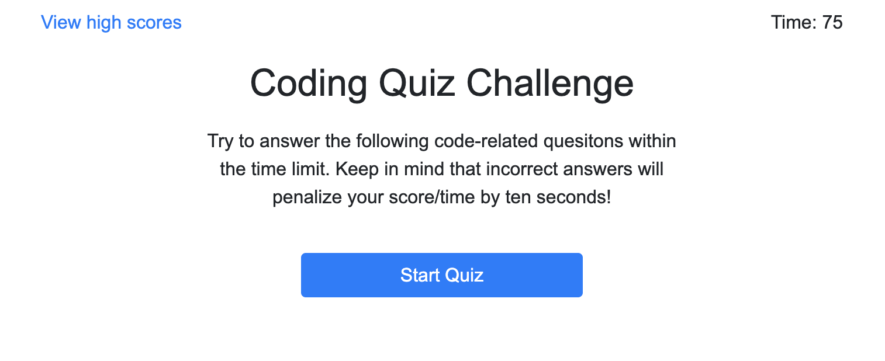
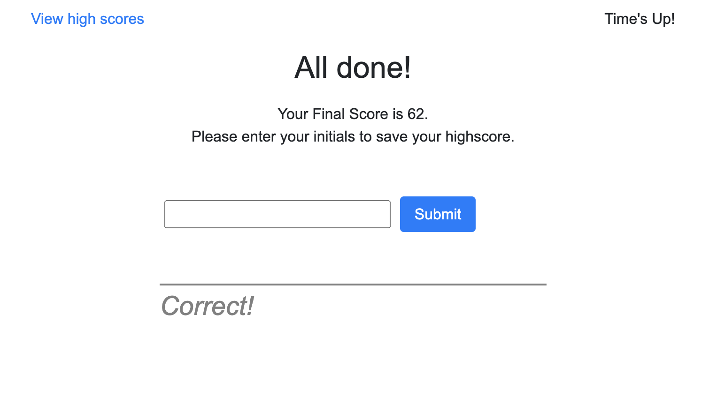

# Coding Quiz

## Purpose

This Coding Quiz Application has been developed to allow coding students to practice their JavaScript knowledge, logging their highscores in order to track a user's progress and/or compare that progress to peers. 

As a developer, this project enhanced my knowledge of JavaScript structure & syntax, different ways of dynamically creating & selecting elements, and creating a user responsive webpage. It also increased my functional knowledge of dealing with local storage and different node manipulation.

### Given User Story

AS A coding boot camp student
I WANT to take a timed quiz on JavaScript fundamentals that stores high scores
SO THAT I can gauge my progress compared to my peers

### This application has been developed to:

1. On click of the start button
2. A countdown timer starts and the user is presented with a question
3. When an answer is clicked, the user is presented with another question
4. If a question is answered incorrectly, time is deduced from the clock
5. The quiz ends when either all questions have been answered or the timer reaches 0
6. When the quiz is over, the user can save their initials and score

## Application Details

While this application is not optimized for particular screen sizes, it will display best at 768px and larger.

Main application code runs through JavaScript.

### JavaScript Logic Summary

- There are three main sections to this html: (1) the header, which contains the "view high scores" and timer elements, (2) the main, which contains all quiz elements, and (3) the highscores section, which contains all highscore elements. The main & highscores sections are selectively hidden using JS class declarations.
- All quiz questions are stored as objects within the quizQuestionsArr Array, referenced using the quizQuestionsIndex, declared globally
- On click of the start button, the timerCountdown function runs, which in turn calls the loadFirstQuestion function to begin the quiz. Once the buttons are dynamically created, validateFirstQuestion is called, listens for the click event, and determines the result of the event target.
- loadQuestion is called at the end of validateFirstQuestion, which dynamically creates all quiz elements for the first question in the array, listens for the click event, and validates the answer. We then increment manually with currentQuestionIndex++, run checkEndQuiz to determine if end quiz conditions have been met, and then either run loadQuestion or endQuiz
- endQuiz styles the form for inputting initials, captures user input, and deals with local storage (we set local storage using the highscoresArr and get local storage back with lsHighscores)

### Main Files in Repository

- index.html
- style.css
- script.js

This application also utilizes Bootstrap style classes. 

## Deployed Application

[(Link to deployed application)](https://emmazart.github.io/coding-quiz/index.html)

### Screenshot of deployed application:

The following screenshots are of the page (1) upon load, (2) after the start button has been clicked, (3) after the last question has been answered, and (4) after the user hits submit on their initials

![Screenshot of page after start button is clicked]

