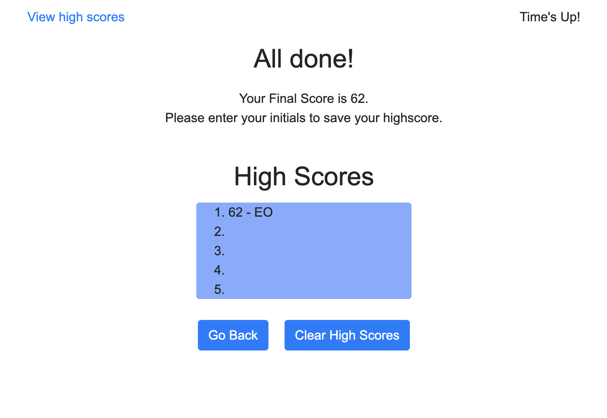

# Coding Quiz

## Purpose

### Given User Story

AS A coding boot camp student
I WANT to take a timed quiz on JavaScript fundamentals that stores high scores
SO THAT I can gauge my progress compared to my peers

### This application has been developed to:

1. On click of the start button
2. A countdown timer starts and the user is presented with a question
3. When an answer is clicked, the user is presented with another question
4. If a question is answered incorrectly, time is deduced from the clock
5. The quiz ends when either all questions have been answered or the timer reaches 0
6. When the quiz is over, the user can save their initials and score

## Application Details

While this application is not optimized for particular screen sizes, it will display best at 768px and larger.

Main application code runs through JavaScript.

### JavaScript Logic Summary

### Main Files in Repository

- index.html
- style.css
- script.js

This application also utilizes Bootstrap style classes. 

## Deployed Application

### Screenshot of deployed application:

The following screenshots are of the page (1) upon load, (2) after the start button has been clicked, (3) after the last question has been answered, and (4) after the user hits submit on their initials

![Screenshot of page after start button is clicked]

